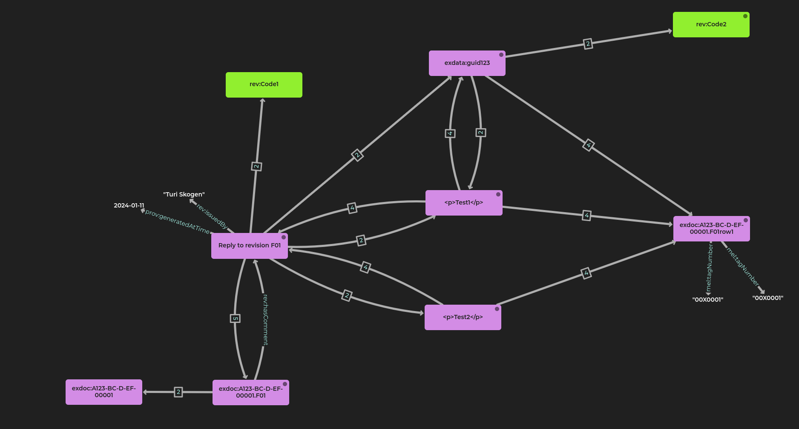

# Example 
Based on this
```json
[
    {
        "UniqueId": "00X0001",
        "Text": "<p>Test1</p>",
        "DocumentName": "C232-AI-R-LA-00001",
        "Revision": "F01",
        "User": "Sondre Eide Vik",
        "Guid": "a9168f1c-4289-406c-9714-151902bd4ae9"
    },
    {
        "UniqueId": "00X0001",
        "Text": "<p>Test2</p>",
        "DocumentName": "C232-AI-R-LA-00001",
        "Revision": "F01",
        "User": "Sondre Eide Vik",
        "Guid": "ee66ec08-f11c-48c8-88a9-83da73c37686"
    },
    {
        "UniqueId": "00X0001",
        "Text": "<p>Test3</p>",
        "DocumentName": "C232-AI-R-LA-00001",
        "Revision": "F01",
        "User": "Sondre Eide Vik",
        "Guid": "20ae854e-ddb0-4abc-89b8-21ed98eecc4d"
    }
]
```
We create this
```turtle
@prefix rdf: <http://www.w3.org/1999/02/22-rdf-syntax-ns#>.
@prefix rdfs: <http://www.w3.org/2000/01/rdf-schema#>.
@prefix xsd: <http://www.w3.org/2001/XMLSchema#>.
@prefix exdata: <https://example.com/data/>.
@prefix exdoc: <https://example.com/doc/>.
@prefix rec: <https://rdf.equinor.com/ontology/record/>.
@prefix rev: <https://rdf.equinor.com/ontology/revision/>.
@prefix review: <https://rdf.equinor.com/ontology/review/>.
@prefix prov: <http://www.w3.org/ns/prov#>.
@prefix rdl: <http://example.com/rdl/>.
@prefix mel:            <https://rdf.equinor.com/ontology/mel/v1#> .


exdata:RecordID123.1 {
    exdata:RecordID123.1 a rec:Record;
        rdfs:comment "This is the revision";
                        rec:isInScope 
                            <https://rdf.equinor.com/ontology/technical-requirement/v1#MelReportingTemplate>, 
                            <https://commonlib.equinor.com/rdf/code/Project/1JjvqAHFRbED1YPuaY> , 
                            <https://commonlib.equinor.com/rdf/code/LCIContractor/4Do7Yb64WXh> ,
                            <https://commonlib.equinor.com/rdf/code/Contract/1JjvqAHFRbED1YPuaX> , 
                            <https://commonlib.equinor.com/rdf/code/Facility/FM5LjGVt> ;
                        rec:describes exdoc:A123-BC-D-EF-00001.F01.
    exdoc:A123-BC-D-EF-00001.F01 a rev:Revision;
        rev:describes exdoc:A123-BC-D-EF-00001.
    exdoc:A123-BC-D-EF-00001.F01row1 mel:tagNumber "00X0001".
}

exdata:RecordID123.5 {
    exdata:RecordID123.5 a rec:Record;
                        rdfs:comment "Based on example data from Sondre"^^xsd:string;
                        prov:generatedAtTime "2024-01-11"^^xsd:date;
                        rec:isInScope review:Review, 
                            <https://rdf.equinor.com/ontology/technical-requirement/v1#MelReportingTemplate>, 
                            <https://commonlib.equinor.com/rdf/code/Project/1JjvqAHFRbED1YPuaY> , 
                            <https://commonlib.equinor.com/rdf/code/LCIContractor/4Do7Yb64WXh> ,
                            <https://commonlib.equinor.com/rdf/code/Contract/1JjvqAHFRbED1YPuaX> , 
                            <https://commonlib.equinor.com/rdf/code/Facility/FM5LjGVt> ;
                        rec:describes exdoc:A123-BC-D-EF-00001.F01.

    exdoc:reply-A123-BC-D-EF-00001.F01 a review:Review;
                                review:aboutVersion exdoc:A123-BC-D-EF-00001.F01;
                                review:issuedBy "Turi Skogen";
                                prov:generatedAtTime "2024-01-11"^^xsd:date;
                                rdf:type review:Code1;
                                rdfs:label "Reply to revision F01";
                                review:hasComment exdata:a9168f1c-4289-406c-9714-151902bd4ae9, 
                                    exdata:ee66ec08-f11c-48c8-88a9-83da73c37686, 
                                    exdata:20ae854e-ddb0-4abc-89b8-21ed98eecc4d.
                            
    
    exdata:a9168f1c-4289-406c-9714-151902bd4ae9 a review:Comment;
                                rdfs:label "<p>Test1</p>"^^xsd:string;
                                review:issuedBy "Turi Skogen";
                                prov:generatedAtTime "2024-01-10"^^xsd:date;
                                review:aboutObject exdoc:A123-BC-D-EF-00001.F01row1 .

    exdata:ee66ec08-f11c-48c8-88a9-83da73c37686 a review:Comment;
                                rdfs:label "<p>Test2</p>"^^xsd:string;
                                review:issuedBy "Turi Skogen";
                                prov:generatedAtTime "2024-01-10"^^xsd:date;
                                review:aboutObject exdoc:A123-BC-D-EF-00001.F01row1 .
                            
    exdata:20ae854e-ddb0-4abc-89b8-21ed98eecc4d a review:Comment;
                                rdfs:label "<p>Test3</p>"^^xsd:string;
                                review:issuedBy "Turi Skogen";
                                prov:generatedAtTime "2024-01-10"^^xsd:date;
                                review:aboutObject exdoc:A123-BC-D-EF-00001.F01row1 .

}


```
### Some of the IDs here are copied from the input revision
* All scopes except review:Review. (Facility, Project, COntract, Contractor, and MelReportingTemplate). Including all scopes from the revision is also ok, although perhaps slightly misleading. 
* The object of the relation review:aboutVersion
* The objects of the relation review:aboutObject

### Some of the IDs are generated
* The record IRI (antyhing goes, but must be unique)
* The comment IRI (based on comment ID?)
* The ID of the Review. It must be unique for the revision, but otherwise anything goes - the link to the revision is in the aboutRevision property


