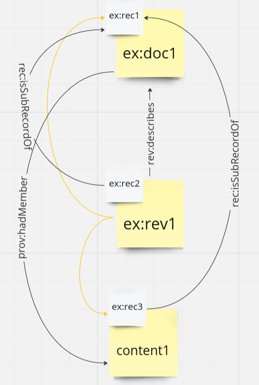
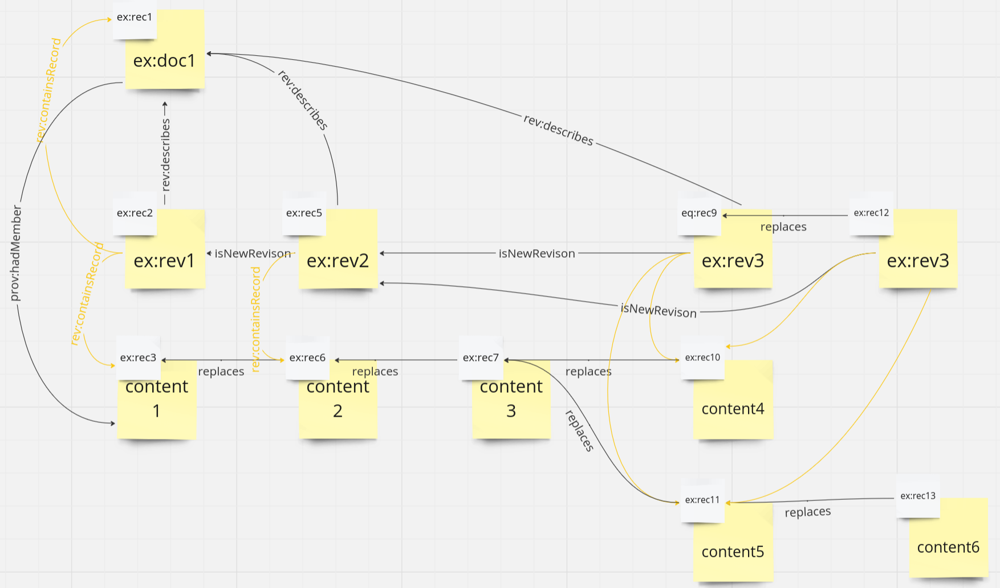

# Revision Example

For general introduction see the [readme](../README.md)

The example is about transmitting MasterEquipmentList according to to the TR1244 format
at https://commonlib.equinor.com/Schema#/specification/TR1244. However, it should be applicable to other use cases with small changes.

There are three main types of objects, the individual **MEL rows**, the **MEL document**, and the **revision**.

## MEL rows
The rows are the content and not defined here, so therefore the smallest part of the MEL document. Each row has information about one part of what it describes, like its name, its weight, its size, and so on. 
The individual MEL rows (often called "content" here) are identified by persistent IRIs created by the contractor.

## MEL document
The MEL document is an instance of the "document" described in the [readme](../README.md), and has information about the whole project, like its name, its number, its site, and so on.
The MEL document is identified by the combination of site and document number and represents the concept of weight estimates for a given contract. 

## Revision
Revisions are also described in the [readme](../README.md). For the Mel case is identified uniquely by the combination of site, document number and revision number.
Revisions have information about when and how a document was changed. For example, if you add a new part to a machine or change the weight of an existing part, you need to make a new revision.
The revision represents a specific version of data, frozen at some moment in time. It is identified uniquely by the combination of site, document number and revision number. 
It is meant to represent the existing revision concept and should support review processes.
The revision is related to all records that contain the data of that revision with the relation "rev:containsRecord". The triples of this relation _must_ be in the record describing the revision.
If the revision is delivered as one big record with document, revision and data, this relation is unnecessary. 
We recommend putting the revision in a separate record for ease of manual reading during investigation.

## Examples
The mel rows are connected both to the document and to the revision. The revision is related to the record containing the rows as described above,
and the mel document is directly related to the row IRIs. We recommend putting the triples of the latter relation in the same record as the actual row.



```trig
@prefix rdf: <http://www.w3.org/1999/02/22-rdf-syntax-ns#> .
@prefix rdfs: <http://www.w3.org/2000/01/rdf-schema#> .
@prefix prov: <http://www.w3.org/ns/prov#> .
@prefix skos: <http://www.w3.org/2004/02/skos/core#> .
@prefix xsd: <http://www.w3.org/2001/XMLSchema#> .
@prefix rec: <https://rdf.equinor.com/ontology/record/> .
@prefix rev: <https://rdf.equinor.com/ontology/revision/> .
@prefix tie: <https://rdf.equinor.com/ontology/TIE#> .
@prefix TR: <https://rdf.equinor.com/ontology/technical-requirement/v1#> .
@prefix bravo: <https://rdf.equinor.com/ontology/bravo-api#> .
@prefix ex: <https://example.com/data> .

ex:rec1 {
    ex:rec1 a rec:Record ;
            prov:generatedAtTime  "2023-06-01"^^xsd:date ;
            rec:isInScope         ex:doc1, TR:MelReportingTemplate, TR:TR1244Document;
            rec:describes         ex:doc1 .
    ex:doc1 a TR:MelReportingTemplate ;
            rdfs:label              "A123-AB-A-AB-0001" ;
            tie:hasTitle            "MEL Alternative 1" .
}

ex:rec3 {
    ex:rec3 a rec:Record ;
            prov:generatedAtTime  "2023-06-01"^^xsd:date ;
            rec:isInScope      ex:doc1, TR:MelReportingTemplate, TR:TR1244Document, bravo:Content ;
            rec:isSubRecordOf  ex:rec1 ;
            rec:describes      ex:doc1 .
    ex:doc1  a TR:MelReportingTemplate ;
            prov:hadMember  ex:melrow1, ex:melrow2 .
    ex:melrow1  TR:some_mel_property  "value" .
    ex:melrow2  TR:some_mel_property  "value2" .
}

ex:rec2 {
    ex:rec2 a rec:Record ;
            prov:generatedAtTime  "2023-06-01"^^xsd:date ;
            rec:isSubRecordOf  ex:rec1 ;
            rec:describes      ex:rev1 ;
            rec:isInScope         ex:document-iri, ex:revision-iri, TR:MelReportingTemplate, TR:TR1244Document .
    ex:rev1 a rev:DocumentRevision, tie:OfficialRevision, tie:RevisionForInformation ;
            rdfs:label              "Rev1" ;
            prov:generatedAtTime    "2023-02-27"^^xsd:date ;
            tie:wasIssuedForReason  "Issued for review" ;
            rev:containsRecord      ex:rec1, ex:rec3 ;
            rev:describes           ex:doc1 ;
            rev:revisionNumber      "01" .
}

```


In this (complete) example, the yellow boxes represent the content of a record,
while the small white ones represent the record provenance and id. eq:doc1 is a document (iri), which eq:rev1 is a revision IRI.

The yellow lines out from the revision, represents the relation from revision to record.

The black arrow from revision to document is the "rev:describes" relation which links a revision to what it is revising.
The black arrow from document IRI to content is the prov:hadMember relation from document to row.


The intended reader usage is that the content of the records for a given revision will be merged and be queryable or visualized without the record information. 

There is no explicit restriction on how this data is split into records. We have used three, one for the content, one for the revision, and one for the document. 
There could also be one record per row of the mel sheet, but that does create a lot of noise. 
The division of data into three records is what has been most practical for us, and we think it is the most flexible. It
means the document metadata might only need to be sent once, and the revision be sent only when a revision is finished,
while content can be split up in any way.





## Content

This includes main content (the actual mel rdf), which is mostly specified elsewhere (in the mel ontology)
The exception is the relation to the top level "document-iri", which is described both by this record and the top-level "document record"

### Elements:

- mel-row-iri and another-mel-row-iri: Persistent identifier of the row / equipment in the mel
- <x>-record-iri: Iri identifying some record. This must be unique for the record, and must be stored for use with the
  replaces relation
- document-iri: The persistent identifier of the TR1244 Document based on the TR1244 fields Facility and the DocumentNo.
  In lack of a central id registry we suggest this IRI: https://rdf.equinor.com/fam/document/<Facility>/<DocumentNo>.
- revision-iri: The persistent identifier of the TR1244 Revision based on the TR1244 fields Facility, DocumentNo and
  RevNo. In lack of a central id registry we suggest this IRI: <document-iri>/revision/<RevNo>


Example in trig
```trig
@prefix rdf: <http://www.w3.org/1999/02/22-rdf-syntax-ns#> .
@prefix rdfs: <http://www.w3.org/2000/01/rdf-schema#> .
@prefix xsd: <http://www.w3.org/2001/XMLSchema#> .
@prefix rec: <https://rdf.equinor.com/ontology/record/> .
@prefix prov: <http://www.w3.org/ns/prov#> .
@prefix skos: <http://www.w3.org/2004/02/skos/core#> .
@prefix tie: <https://rdf.equinor.com/ontology/TIE#> .
@prefix TR: <https://rdf.equinor.com/ontology/technical-requirement/v1#> .
@prefix bravo: <https://rdf.equinor.com/ontology/bravo-api#> .
@prefix ex: <https://example.com/data> .

ex:content-record-iri {
    ex:content-record-iri
            rdf:type           rec:Record ;
            prov:generatedAtTime  "2023-06-01"^^xsd:date ;
            rec:isInScope      ex:document-iri, TR:MelReportingTemplate, TR:TR1244Document, bravo:Content ;
            rec:isSubRecordOf  ex:document-record-iri ;
            rec:describes      ex:document-iri .
    ex:document-iri a TR:MelReportingTemplate ;
            prov:hadMember  ex:melrow1, ex:melrow2 .
    ex:melrow1  TR:some_mel_property  "value" .
    ex:melrow2  TR:some_mel_property  "value2" .
}

```
And in json-ld

```json
{
  "@id": "<content-record-iri>",
  "@graph": [
    {
      "@id": "<mel-row-iri>",
      "<TR:some-mel-property>": [
        {
          "@value": "<somevalue>"
        }
      ],
      "<TR:another property>": [
        {
          "@value": "<someothervalue>"
        }
      ]
    },
    {
      "@id": "<another-mel-row-iri>",
      "<TR:some-mel-property>": [
        {
          "@value": "value"
        }
      ],
      "<TR:another property>": [
        {
          "@value": "value2"
        }
      ]
    },
    {
      "@id": "<content-record-iri>",
      "@type": [
        "https://rdf.equinor.com/ontology/record/Record"
      ],
      "https://rdf.equinor.com/ontology/record/isInScope": [
        {
          "@id": "<document-iri>"
        },
        {
          "@id": "https://rdf.equinor.com/ontology/technical-requirement/v1#MelReportingTemplate"
        },
        {
          "@id": "https://rdf.equinor.com/ontology/technical-requirement/v1#TR1244Document"
        },
        {
          "@id": "https://rdf.equinor.com/ontology/bravo-api#Content"
        }
      ],
      "https://rdf.equinor.com/ontology/record/isSubRecordOf": [
        {
          "@id": "<document-record-iri>"
        }
      ],
      "https://rdf.equinor.com/ontology/record/describes": [
        {
          "@id": "<document-iri>"
        }
      ]
    },
    {
      "@id": "<document-iri>",
      "@type": [
        "https://rdf.equinor.com/ontology/technical-requirement/v1#MelReportingTemplate"
      ],
      "http://www.w3.org/ns/prov#hadMember": [
        {
          "@id": "<mel-row-iri>"
        },
        {
          "@id": "<another-mel-row-iri>"
        }
      ]
    }
  ]
}
```

## Revision

### Elements:

- <record generation date> : Date of creation of the record, f.ex. 2023-09-07
- revision-name: Revision human readable name of revision, f.ex. <TR1244:DocumentNumber>.<TR1244:Revision>
- <TR1244:Revision>: The field Revision in TR124. For example 01

The types on revision are:

- rev:DocumentRevision from the public revision.ttl in the records repo
- tie:OfficialRevision from the internal tie.ttl ontology. This is always true for MEL, for other document types can
  change
- tie:RevisionForReview from the internal tie.ttl ontology. This corresponds to TR1244:Purpose. See tie.ttl for other
  values

Example in trig

```trig
@prefix rdf: <http://www.w3.org/1999/02/22-rdf-syntax-ns#> .
@prefix rdfs: <http://www.w3.org/2000/01/rdf-schema#> .
@prefix xsd: <http://www.w3.org/2001/XMLSchema#> .
@prefix rec: <https://rdf.equinor.com/ontology/record/> .
@prefix prov: <http://www.w3.org/ns/prov#> .
@prefix skos: <http://www.w3.org/2004/02/skos/core#> .
@prefix tie: <https://rdf.equinor.com/ontology/TIE#> .
@prefix TR: <https://rdf.equinor.com/ontology/technical-requirement/v1#> .
@prefix ex: <https://example.com/data> .

ex:revision-record-iri {
    ex:revision-record-iri a rec:Record ;
            prov:generatedAtTime  "2023-06-01"^^xsd:date ;
            rec:isInScope         ex:document-iri, ex:revision-iri, TR:MelReportingTemplate, TR:TR1244Document ;
            rec:describes         ex:revision-iri ;
            rec:isSubRecordOf     ex:document-record-iri .
    ex:revision-iri a rev:DocumentRevision, tie:OfficialRevision, tie:RevisionForInformation ;
            rdfs:label              "MEL-01.01" ;
            prov:generatedAtTime    "2023-02-27"^^xsd:date ;
            tie:wasIssuedForReason  "Issued for debug" ;
            rev:containsRecord      ex:content-record-iri, ex:document-record-iri ;
            rev:describes           ex:document-iri ;
            rev:revisionNumber      "01" .
}

```

```json
{
  "@id": "<revision-record-iri>",
  "@graph": [
    {
      "@id": "<revision-iri>",
      "@type": [
        "https://rdf.equinor.com/ontology/revision/DocumentRevision",
        "https://rdf.equinor.com/ontology/TIE#OfficialRevision",
        "https://rdf.equinor.com/ontology/TIE#RevisionForReview"
      ],
      "http://www.w3.org/ns/prov#generatedAtTime": [
        {
          "@value": "<TR1244:RevisionDate>",
          "@type": "http://www.w3.org/2001/XMLSchema#date"
        }
      ],
      "http://www.w3.org/2000/01/rdf-schema#label": [
        {
          "@value": "<revision-name>"
        }
      ],
      "https://rdf.equinor.com/ontology/revision/revisionNumber": [
        {
          "@value": "<TR1244:Revision>"
        }
      ],
      "https://rdf.equinor.com/ontology/revision/describes": [
        {
          "@id": "<document-iri>"
        }
      ],
      "https://rdf.equinor.com/ontology/revision/containsRecord": [
        {
          "@id": "<document-record-iri>"
        },
        {
          "@id": "<content-record-iri>"
        }
      ],
      "https://rdf.equinor.com/ontology/TIE#wasIssuedForReason": [
        {
          "@value": "<TR1244: ReasonForIssue>"
        }
      ]
    },
    {
      "@id": "<revision-record-iri>",
      "http://www.w3.org/ns/prov#generatedAtTime": [
        {
          "@value": "<record generation date>",
          "@type": "http://www.w3.org/2001/XMLSchema#date"
        }
      ],
      "@type": [
        "https://rdf.equinor.com/ontology/record/Record"
      ],
      "https://rdf.equinor.com/ontology/record/isSubRecordOf": [
        {
          "@id": "<document-record-iri>"
        }
      ],
      "https://rdf.equinor.com/ontology/record/isInScope": [
        {
          "@id": "<document-iri>"
        },
        {
          "@id": "<https://rdf.equinor.com/ontology/technical-requirement/v1#MelReportingTemplate>"
        },
        {
          "@id": "<https://rdf.equinor.com/ontology/technical-requirement/v1#TR1244Document>"
        },
        {
          "@id": "<revision-iri>"
        },
        {
          "@id": "https://rdf.equinor.com/ontology/revision/Revision"
        }
      ],
      "https://rdf.equinor.com/ontology/record/describes": [
        {
          "@id": "<revision-iri>"
        }
      ]
    }
  ]
}
```

## Document

- <TR1244:DocumentNo> : The document number (as text, not an IRI), same as used in TR1244 field DocumentNo
- <TR1244:Title>: The human readable plain-text title of the document as given in TR1244 field Title

Example in trig
```trig
@prefix rdf: <http://www.w3.org/1999/02/22-rdf-syntax-ns#> .
@prefix rdfs: <http://www.w3.org/2000/01/rdf-schema#> .
@prefix xsd: <http://www.w3.org/2001/XMLSchema#> .
@prefix rec: <https://rdf.equinor.com/ontology/record/> .
@prefix prov: <http://www.w3.org/ns/prov#> .
@prefix skos: <http://www.w3.org/2004/02/skos/core#> .
@prefix tie: <https://rdf.equinor.com/ontology/TIE#> .
@prefix TR: <https://rdf.equinor.com/ontology/technical-requirement/v1#> .
@prefix ex: <https://example.com/data> .

ex:document-record-iri {
    ex:document-record-iri a rec:Record ;
            prov:generatedAtTime  "2023-06-01"^^xsd:date ;
            rec:isInScope         ex:document-iri, TR:MelReportingTemplate;
            rec:describes         ex:document-iri .
    ex:document-iri a TR:MelReportingTemplate ;
            rdfs:label              "Document Number" ;
            tie:hasTitle            "TR1244:Title" .
}

```

```json
{
  "@id": "<document-record-iri>",
  "@graph": [
    {
      "@id": "<document-iri>",
      "@type": [
        "https://rdf.equinor.com/ontology/technical-requirement/v1#MelReportingTemplate"
      ],
      "http://www.w3.org/2000/01/rdf-schema#label": [
        {
          "@value": "<TR1244:DocumentNo>"
        }
      ],
      "https://rdf.equinor.com/ontology/TIE#hasTitle": [
        {
          "@value": "<TR1244:Title>"
        }
      ]     
    },
    {
      "@id": "<document-record-iri>",
      "http://www.w3.org/ns/prov#generatedAtTime": [
        {
          "@value": "<record-creation-date>",
          "@type": "http://www.w3.org/2001/XMLSchema#date"
        }
      ],
      "@type": [
        "https://rdf.equinor.com/ontology/record/Record"
      ],
      "https://rdf.equinor.com/ontology/record/isInScope": [
        {
          "@id": "<document-iri>"
        },
        {
          "@id": "<https://rdf.equinor.com/ontology/technical-requirement/v1#MelReportingTemplate>"
        },
        {
          "@id": "<https://rdf.equinor.com/ontology/technical-requirement/v1#TR1244Document>"
        }
      ],
      "https://rdf.equinor.com/ontology/record/describes": [
        {
          "@id": "<document-iri>"
        }
      ]
    }
  ]
}
```

## New content

When sending new content, the property "rec:replaces" is used to signal what content is hidden by the new content.
For example like this. The json-ld file below contains three records, that have to be sent together (Either in the same
file as shown, or in multiple files in the same message)
Otherwise they are interpreted as a branching, which is currently not allowed for MEL

```json
[
  {
    "@id": "<content-record-iri-2>",
    "@graph": [
      {
        "@id": "<mel-row-iri>",
        "<some-mel-property>": [
          {
            "@value": "<somevalue>"
          }
        ],
        "<another property>": [
          {
            "@value": "<someothervalue>"
          }
        ]
      },
      {
        "@id": "<content-record-iri-2>",
        "@type": [
          "https://rdf.equinor.com/ontology/record/Record"
        ],
        "https://rdf.equinor.com/ontology/record/isInScope": [
          {
            "@id": "<document-iri>"
          },
          {
            "@id": "<https://rdf.equinor.com/ontology/technical-requirement/v1#MelReportingTemplate>"
          },
          {
            "@id": "<https://rdf.equinor.com/ontology/technical-requirement/v1#TR1244Document>"
        }
        ],
        "https://rdf.equinor.com/ontology/record/isSubRecordOf": [
          {
            "@id": "<document-record-iri>"
          }
        ],
        "https://rdf.equinor.com/ontology/record/describes": [
          {
            "@id": "<mel-row-iri>"
          }
        ]
      }
    ]
  },
  {
    "@id": "<content-record-iri-3>",
    "@graph": [
      {
        "@id": "<another-mel-row-iri>",
        "<some-mel-property>": [
          {
            "@value": "<somevalue3>"
          }
        ],
        "<another property>": [
          {
            "@value": "<someothervalue4>"
          }
        ]
      },
      {
        "@id": "<third-mel-row-iri>",
        "<some-mel-property>": [
          {
            "@value": "<somevalue6>"
          }
        ],
        "<another property>": [
          {
            "@value": "<someothervalue8>"
          }
        ]
      },
      {
        "@id": "<content-record-iri-3>",
        "@type": [
          "https://rdf.equinor.com/ontology/record/Record"
        ],
        "https://rdf.equinor.com/ontology/record/isInScope": [
          {
            "@id": "<document-iri>"
          },
          {
            "@id": "<https://rdf.equinor.com/ontology/technical-requirement/v1#MelReportingTemplate>"
          },
          {
            "@id": "<https://rdf.equinor.com/ontology/technical-requirement/v1#TR1244Document>"
          }
        ],
        "https://rdf.equinor.com/ontology/record/isSubRecordOf": [
          {
            "@id": "<document-record-iri>"
          }
        ],
        "https://rdf.equinor.com/ontology/record/describes": [
          {
            "@id": "<another-mel-row-iri>"
          },
          {
            "@id": "<third-mel-row-iri>"
          }
        ]
      }
    ]
  },
  {
    "@id": "<content-record-iri-4>",
    "@graph": [
      {
        "@id": "<content-record-iri-4>",
        "@type": [
          "https://rdf.equinor.com/ontology/record/Record"
        ],
        "https://rdf.equinor.com/ontology/record/isInScope": [
          {
            "@id": "<document-iri>"
          },
          {
            "@id": "<https://rdf.equinor.com/ontology/technical-requirement/v1#MelReportingTemplate>"
          },
          {
            "@id": "<https://rdf.equinor.com/ontology/technical-requirement/v1#TR1244Document>"
          }
        ],
        "https://rdf.equinor.com/ontology/record/isSubRecordOf": [
          {
            "@id": "<document-record-iri>"
          }
        ],
        "https://rdf.equinor.com/ontology/record/describes": [
          {
            "@id": "<mel-document-iri>"
          }
        ]
      },
      {
        "@id": "<mel-document-iri>",
        "http://www.w3.org/ns/prov#hadMember": [
          {
            "@id": "<mel-row-iri>"
          },
          {
            "@id": "<another-mel-row-iri>"
          },
          {
            "@id": "<third-mel-row-iri>"
          }
        ]
      }
    ]
  }
]
```

## New Revision

When sending a new revision, the relation "rev:isNewRevisionOf" is used to relate to the previous revision, while prov:
hadMember is relating it to the records containing the content.
(If updating an already sent revision, the relation "rec:replaces" is used as for content)
The revision below could be sent after (or at the same time) as the new content above

```json
{
  "@id": "<revision2-record-iri>",
  "@graph": [
    {
      "@id": "<revision2-iri>",
      "@type": [
        "https://rdf.equinor.com/ontology/revision/DocumentRevision",
        "https://rdf.equinor.com/ontology/TIE#OfficialRevision",
        "https://rdf.equinor.com/ontology/TIE#RevisionForReview"
      ],
      "http://www.w3.org/ns/prov#generatedAtTime": [
        {
          "@value": "<TR1244:RevisionDate>",
          "@type": "http://www.w3.org/2001/XMLSchema#date"
        }
      ],
      "http://www.w3.org/2000/01/rdf-schema#label": [
        {
          "@value": "<revision2-name>"
        }
      ],
      "https://rdf.equinor.com/ontology/revision/revisionNumber": [
        {
          "@value": "<TR1244:Revision>"
        }
      ],
      "https://rdf.equinor.com/ontology/revision/describes": [
        {
          "@id": "<document-iri>"
        }
      ],
      "https://rdf.equinor.com/ontology/revision/isNewRevisionOf": [
        {
          "@id": "<revision-iri>"
        }
      ],
      "https://rdf.equinor.com/ontology/revision/containsRecord": [
        {
          "@id": "<document-record-iri>"
        },
        {
          "@id": "<content-record-iri-2>"
        },
        {
          "@id": "<content-record-iri-3>"
        },
        {
          "@id": "<content-record-iri-4>"
        }
      ],
      "https://rdf.equinor.com/ontology/TIE#wasIssuedForReason": [
        {
          "@value": "<TR1244: ReasonForIssue>"
        }
      ]
    },
    {
      "@id": "<revision-record-iri>",
      "http://www.w3.org/ns/prov#generatedAtTime": [
        {
          "@value": "<record generation date>",
          "@type": "http://www.w3.org/2001/XMLSchema#date"
        }
      ],
      "@type": [
        "https://rdf.equinor.com/ontology/record/Record"
      ],
      "https://rdf.equinor.com/ontology/record/isSubRecordOf": [
        {
          "@id": "<document-record-iri>"
        }
      ],
      "https://rdf.equinor.com/ontology/record/isInScope": [
        {
          "@id": "<document-iri>"
        },
        {
          "@id": "<https://rdf.equinor.com/ontology/technical-requirement/v1#MelReportingTemplate>"
        },
        {
          "@id": "<https://rdf.equinor.com/ontology/technical-requirement/v1#TR1244Document>"
        },
        {
          "@id": "<revision2-iri>"
        }
      ],
      "https://rdf.equinor.com/ontology/record/describes": [
        {
          "@id": "<revision2-iri>"
        }
      ]
    }
  ]
}
```

## Transformations done (or should be done) by Bravo

- The scopes for facility, project, contract and contractor are parsed from the tie message and added to all records
  received over tie
- Any scope is added on the relation skos:related for all elements in describes
- The type and label of any scope (usually as seen from commonlib) is added to the content

## These problems are not fixed:

- What IRI should the doument and revision have, and could the document and revision name be in some central register?
- Could commonlib have a query for the type or even the triples about some commonlib iri
